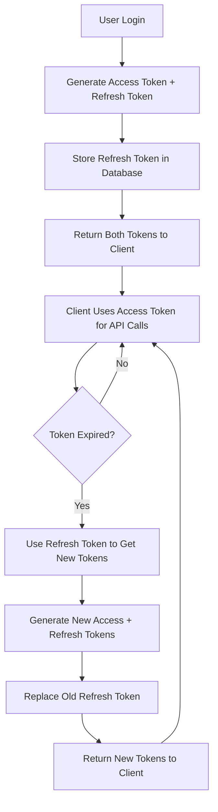

# JWT Token Management Guide

## 🔐 Token Expiration & Refresh System

### Current Token Configuration

| Token Type | Expiration | Purpose |
|------------|------------|---------|
| **Access Token** | 7 days (configurable) | API authentication |
| **Refresh Token** | 30 days | Token renewal |

### Token Lifecycle



## 🚀 How Token Expiration Works

### 1. **Access Token Expiration (7 days)**
- **What happens**: API calls return `401 Unauthorized` with `TOKEN_EXPIRED` error
- **Client response**: Automatically use refresh token to get new access token
- **User experience**: Seamless - no need to login again

### 2. **Refresh Token Expiration (30 days)**
- **What happens**: Refresh token becomes invalid
- **Client response**: Redirect user to login screen
- **User experience**: User must login again after 30 days

### 3. **Token Revocation**
- **Logout**: Client removes tokens from storage
- **Logout All**: Server invalidates all refresh tokens for user
- **Account deactivation**: All tokens become invalid immediately

## 📱 Flutter Implementation

### Updated API Service with Token Refresh

```dart
class ApiService {
  static String? _accessToken;
  static String? _refreshToken;

  // Initialize tokens from storage
  static Future<void> initialize() async {
    final prefs = await SharedPreferences.getInstance();
    _accessToken = prefs.getString('access_token');
    _refreshToken = prefs.getString('refresh_token');
  }

  // Save tokens to storage
  static Future<void> saveTokens(String accessToken, String refreshToken) async {
    final prefs = await SharedPreferences.getInstance();
    await prefs.setString('access_token', accessToken);
    await prefs.setString('refresh_token', refreshToken);
    _accessToken = accessToken;
    _refreshToken = refreshToken;
  }

  // Clear tokens
  static Future<void> clearTokens() async {
    final prefs = await SharedPreferences.getInstance();
    await prefs.remove('access_token');
    await prefs.remove('refresh_token');
    _accessToken = null;
    _refreshToken = null;
  }

  // Get headers with automatic token refresh
  static Future<Map<String, String>> get _headers async {
    final headers = <String, String>{
      'Content-Type': 'application/json',
    };

    if (_accessToken != null) {
      headers['Authorization'] = 'Bearer $_accessToken';
    }

    return headers;
  }

  // Make API request with automatic token refresh
  static Future<http.Response> _makeRequest(
    String method,
    String url, {
    Map<String, dynamic>? body,
    Map<String, String>? headers,
  }) async {
    final requestHeaders = await _headers;
    if (headers != null) {
      requestHeaders.addAll(headers);
    }

    http.Response response;
    switch (method.toUpperCase()) {
      case 'GET':
        response = await http.get(Uri.parse(url), headers: requestHeaders);
        break;
      case 'POST':
        response = await http.post(
          Uri.parse(url),
          headers: requestHeaders,
          body: body != null ? jsonEncode(body) : null,
        );
        break;
      case 'PUT':
        response = await http.put(
          Uri.parse(url),
          headers: requestHeaders,
          body: body != null ? jsonEncode(body) : null,
        );
        break;
      case 'DELETE':
        response = await http.delete(Uri.parse(url), headers: requestHeaders);
        break;
      default:
        throw Exception('Unsupported HTTP method: $method');
    }

    // Handle token expiration
    if (response.statusCode == 401) {
      final responseBody = jsonDecode(response.body);
      if (responseBody['code'] == 'TOKEN_EXPIRED') {
        // Try to refresh token
        final refreshed = await _refreshAccessToken();
        if (refreshed) {
          // Retry the original request
          return await _makeRequest(method, url, body: body, headers: headers);
        } else {
          // Refresh failed, redirect to login
          await clearTokens();
          throw Exception('Session expired. Please login again.');
        }
      }
    }

    return response;
  }

  // Refresh access token
  static Future<bool> _refreshAccessToken() async {
    if (_refreshToken == null) return false;

    try {
      final response = await http.post(
        Uri.parse('$baseUrl/auth/refresh'),
        headers: {'Content-Type': 'application/json'},
        body: jsonEncode({'refreshToken': _refreshToken}),
      );

      if (response.statusCode == 200) {
        final data = jsonDecode(response.body);
        if (data['success']) {
          await saveTokens(data['token'], data['refreshToken']);
          return true;
        }
      }
    } catch (e) {
      print('Token refresh failed: $e');
    }

    return false;
  }

  // Updated API methods with automatic token refresh
  static Future<Map<String, dynamic>> getServices({
    String? category,
    int page = 1,
    int limit = 10,
  }) async {
    final queryParams = <String, String>{
      'page': page.toString(),
      'limit': limit.toString(),
      if (category != null) 'category': category,
    };
    
    final uri = Uri.parse('$baseUrl/services').replace(
      queryParameters: queryParams,
    );
    
    final response = await _makeRequest('GET', uri.toString());
    return jsonDecode(response.body);
  }

  // Login method with token storage
  static Future<Map<String, dynamic>> login({
    required String email,
    required String password,
  }) async {
    final response = await http.post(
      Uri.parse('$baseUrl/auth/login'),
      headers: {'Content-Type': 'application/json'},
      body: jsonEncode({
        'email': email,
        'password': password,
      }),
    );

    final data = jsonDecode(response.body);
    
    if (data['success']) {
      await saveTokens(data['token'], data['refreshToken']);
    }

    return data;
  }

  // Logout method with token cleanup
  static Future<Map<String, dynamic>> logout() async {
    try {
      await _makeRequest('POST', '$baseUrl/auth/logout');
    } finally {
      await clearTokens();
    }
    
    return {'success': true, 'message': 'Logged out successfully'};
  }

  // Logout from all devices
  static Future<Map<String, dynamic>> logoutAll() async {
    try {
      await _makeRequest('POST', '$baseUrl/auth/logout-all');
    } finally {
      await clearTokens();
    }
    
    return {'success': true, 'message': 'Logged out from all devices'};
  }
}
```

### Updated Authentication Provider

```dart
class AuthProvider with ChangeNotifier {
  User? _user;
  bool _isLoading = false;
  String? _error;

  User? get user => _user;
  bool get isLoading => _isLoading;
  String? get error => _error;
  bool get isAuthenticated => _user != null;

  Future<void> initialize() async {
    await ApiService.initialize();
    await _loadUser();
  }

  Future<void> _loadUser() async {
    try {
      final response = await ApiService.getProfile();
      if (response['success']) {
        _user = User.fromJson(response['user']);
        notifyListeners();
      }
    } catch (e) {
      // Token expired or invalid, clear user
      _user = null;
      await ApiService.clearTokens();
    }
  }

  Future<bool> login(String email, String password) async {
    _setLoading(true);
    _clearError();

    try {
      final response = await ApiService.login(
        email: email,
        password: password,
      );

      if (response['success']) {
        _user = User.fromJson(response['user']);
        notifyListeners();
        return true;
      } else {
        _setError(response['message']);
        return false;
      }
    } catch (e) {
      _setError('Login failed: ${e.toString()}');
      return false;
    } finally {
      _setLoading(false);
    }
  }

  Future<void> logout() async {
    try {
      await ApiService.logout();
    } finally {
      _user = null;
      notifyListeners();
    }
  }

  Future<void> logoutAll() async {
    try {
      await ApiService.logoutAll();
    } finally {
      _user = null;
      notifyListeners();
    }
  }

  void _setLoading(bool loading) {
    _isLoading = loading;
    notifyListeners();
  }

  void _setError(String error) {
    _error = error;
    notifyListeners();
  }

  void _clearError() {
    _error = null;
    notifyListeners();
  }
}
```

## 🔧 Backend Configuration

### Environment Variables

```bash
# Token expiration settings
JWT_EXPIRE=7d                    # Access token expiration
REFRESH_TOKEN_EXPIRE=30d         # Refresh token expiration (in database)

# Security settings
JWT_SECRET=your-super-secret-jwt-key
BCRYPT_ROUNDS=12
```

### Token Expiration Scenarios

| Scenario | Access Token | Refresh Token | User Action Required |
|----------|--------------|---------------|-------------------|
| **Normal API Call** | Valid | Valid | None |
| **Access Token Expired** | Expired | Valid | Auto-refresh (seamless) |
| **Refresh Token Expired** | Expired | Expired | Login required |
| **User Logout** | Invalidated | Invalidated | None |
| **Account Deactivated** | Invalidated | Invalidated | Login required |

## 🛡️ Security Features

### 1. **Token Rotation**
- Each refresh generates new access AND refresh tokens
- Old refresh tokens are immediately invalidated
- Prevents token reuse attacks

### 2. **Token Storage Security**
- Refresh tokens stored in database with expiration
- Access tokens stored in memory only
- Automatic cleanup of expired tokens

### 3. **Multi-Device Support**
- Users can have multiple refresh tokens (different devices)
- `logout-all` endpoint invalidates all tokens
- Device-specific token management

### 4. **Error Handling**
```json
// Token expired response
{
  "success": false,
  "message": "Token expired",
  "code": "TOKEN_EXPIRED",
  "expiredAt": "2024-01-15T10:30:00.000Z"
}

// Invalid token response
{
  "success": false,
  "message": "Invalid token",
  "code": "INVALID_TOKEN"
}
```

## 📊 Monitoring & Analytics

### Token Usage Tracking
- Track token refresh frequency
- Monitor suspicious token usage
- Alert on unusual patterns

### Database Queries for Monitoring
```javascript
// Find users with many refresh tokens (potential security issue)
db.users.find({
  "refreshTokens": { $exists: true, $not: { $size: 0 } }
}).count()

// Find expired refresh tokens
db.users.find({
  "refreshTokens.createdAt": { $lt: new Date(Date.now() - 30*24*60*60*1000) }
})
```

## 🚀 Production Recommendations

### 1. **Token Expiration Times**
- **Access Token**: 15 minutes to 1 hour (shorter = more secure)
- **Refresh Token**: 7-30 days (longer = better UX)

### 2. **Security Headers**
```javascript
// Add to your Express app
app.use(helmet({
  hsts: {
    maxAge: 31536000,
    includeSubDomains: true,
    preload: true
  }
}));
```

### 3. **Rate Limiting for Token Endpoints**
```javascript
const tokenLimiter = rateLimit({
  windowMs: 15 * 60 * 1000, // 15 minutes
  max: 5, // 5 attempts per window
  message: 'Too many token refresh attempts'
});

app.use('/api/auth/refresh', tokenLimiter);
```

### 4. **Token Cleanup Job**
```javascript
// Run daily to clean expired tokens
const cleanupExpiredTokens = async () => {
  await User.updateMany(
    {},
    { $pull: { refreshTokens: { createdAt: { $lt: new Date(Date.now() - 30*24*60*60*1000) } } } }
  );
};
```

## 🎯 Best Practices

### Client-Side
1. **Store tokens securely** (use Flutter Secure Storage)
2. **Implement automatic refresh** before token expires
3. **Handle token errors gracefully** with user-friendly messages
4. **Clear tokens on logout** and app uninstall

### Server-Side
1. **Use strong JWT secrets** (64+ characters)
2. **Implement token rotation** for security
3. **Monitor token usage** for anomalies
4. **Clean up expired tokens** regularly

Your token management system is now **production-ready** with automatic refresh, security best practices, and comprehensive error handling! 🚀
